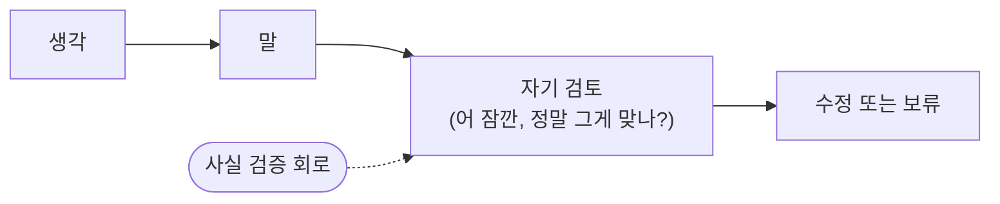
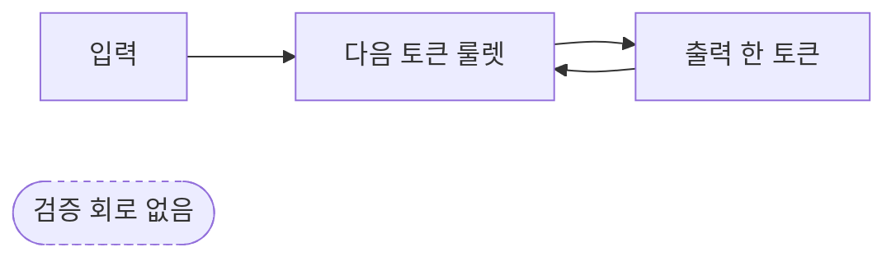

# 06. 환각: 자신있게 거짓말하는 이유

ChatGPT 한테 어떤 책 안에 나오는 인용문을 찾아달라고 부탁한 적이 있는 분이라면, 한 번쯤 이상한 경험을 하셨을 거예요. 그럴듯한 책 제목, 그럴듯한 페이지 번호, 그럴듯한 문장 — 다 받았는데 막상 그 책을 펴보면, 그런 인용문은 없어요. 책은 진짜인데 페이지가 가짜이거나, 책 자체가 존재하지 않거나.

이걸 **환각**(hallucination, AI 가 사실이 아닌 걸 사실인 것처럼 자신만만하게 만들어내는 현상) 이라고 불러요. 거짓말이라고 부르지 않는 건 — AI 가 일부러 속이려고 한 게 아니거든요. 거짓말의 정의에는 "거짓이라는 걸 알면서도" 라는 조건이 들어가는데, AI 는 그 조건을 만족 못 해요.

여기서 더 무서운 진실이 시작돼요.

## AI 는 "모른다" 라는 답을 모릅니다

지난 4화에서 AI 가 답을 만들 때 다음 토큰 후보들의 확률을 계산하고, 그 확률에 따라 룰렛을 돌린다고 했죠. **여기서 핵심은 — 룰렛은 항상 뭔가를 뽑아요.** 후보가 모두 어색해도, 그중 가장 덜 어색한 걸 뽑아요. "이 질문에는 답할 수 없어요" 라는 답을 뽑는 게 아니라, 그냥 어떤 답이든 만들어내요.

그러니까 ChatGPT 한테 잘 모르는 분야 — 예를 들어 1873년 미국 작은 마을의 농산물 가격 — 을 물어보면, 모델 안에 그걸 직접 본 데이터가 없어도 그럴듯해 보이는 숫자를 만들어내요. 룰렛이 어떻게든 돌아가야 하거든요. "그 시기 농산물 가격은 일반적으로 옥수수 한 부셸당 50센트 정도였습니다" — 이런 답이 그럴듯해 보이는 패턴에 따라 자동으로 조립돼요.

## 사람과의 결정적 차이

사람과 AI 의 가장 큰 차이가 여기서 드러나요.

사람의 말 사이클은 이래요.

LLM 의 말 사이클은 이래요.

사람은 말하면서 자기 말을 듣고 검토해요. "어 이거 맞나?" 라는 작은 멈춤이 있어요. 그 멈춤이 우리를 거짓말쟁이가 되지 않게 지켜줘요. 그런데 AI 는 그 멈춤이 없어요. 룰렛 다음에 또 룰렛, 또 룰렛. **자기가 만든 답을 자기가 검증하는 회로 자체가 없어요.**

## 어조는 자신만만, 내용은 룰렛

여기서 더 골치 아픈 부분. **AI 의 "자신만만한 어조" 와 "사실의 정확성" 은 완전히 별개로 학습됐어요.**

학습 데이터에 들어 있는 글들은 대부분 자신감 있게 쓰여 있어요. 백과사전, 논문, 매뉴얼 — 다 "이러한 사실이 있습니다" 라는 톤이에요. AI 는 이 톤을 그대로 익혀요. 그러니까 모르는 분야에 대해서도 익숙한 톤은 그대로 — 자신만만한 어조로 — 답을 내놓아요. 어조는 "확실해요" 인데 내용은 "글쎄, 룰렛 돌려보니 이게 나왔어요" 인 거예요.

이 어긋남이 환각을 위험하게 만들어요. 우리는 자신만만한 톤을 보고 "이 사람 잘 아네" 라고 자동으로 신뢰하잖아요. 그런데 AI 의 자신만만한 톤은 — 그 정보를 정말 알고 있다는 신호가 아니에요. 그냥 학습 데이터의 평균적인 톤이에요. 우리는 그 점을 매번 의식적으로 떠올려야 해요.

## 깜짝 놀랄 만한 한 가지

가장 중요한 것 한 가지. **환각은 AI 의 버그가 아니에요. 작동 원리의 부산물이에요.**

ChatGPT 가 "다음 단어 맞추기 게임" 으로 동작한다는 걸 1화에서 봤잖아요. 그 게임 안에는 처음부터 "사실 여부 검증" 이라는 단계가 들어 있지 않아요. 그러니까 패치나 업데이트로 환각을 완전히 없앨 수는 없어요. 더 똑똑한 모델은 환각을 덜 자주 일으키지만, **0이 되지는 않아요.** 게임 자체에 그게 내장되어 있어서예요.

그래서 AI 회사들은 외부 검색 엔진과 연결하거나(이 방식을 **RAG**(Retrieval-Augmented Generation, 검색으로 보강하는 답 생성) 라고 불러요), 사실 확인용 도구를 따로 붙이거나, 답에 출처를 강제로 붙이게 하거나 — 다양한 방법으로 환각을 줄이려고 노력해요. 하지만 그건 모두 모델 바깥에서 덧대는 장치예요. 모델 자체는 여전히 룰렛을 돌리고 있어요.

## 비유에는 한계가 있어요

"자신만만한 신입사원" 비유는 친근하지만, 신입사원은 일주일 후엔 자기가 모르는 걸 알게 되고 점점 신중해져요. AI 는 그렇지 않아요. 같은 모델이라면 어제도 오늘도 같은 정도로 자신만만해요. 학습이 끝난 시점의 상태로 굳어 있거든요. 신입사원 비유는 자신만만함을 설명하기 좋지만, "성장" 부분은 안 맞아요. 그래서 AI 가 한 답은 — 우리가 출처를 직접 확인하기 전까지는 — 항상 한 발짝 거리를 두고 받아야 해요.

## 한 줄 요약

AI 가 모르는 걸 자신만만하게 답하는 환각은 거짓말이 아니라, "다음 토큰 룰렛" 이라는 작동 원리에 사실 검증 회로가 처음부터 들어 있지 않아서 생기는 부산물이에요.

## 다음 화

이렇게 룰렛만 돌리는 AI 가 어떻게 우리에게 친절하게 말하고, 욕도 안 하고, 위험한 답을 안 하는 걸까요? 그건 학습의 또 다른 단계 — 사람의 손길로 길들여진 결과예요.

[07화 — 사람의 피드백으로 길들이기](07-rlhf.md)
