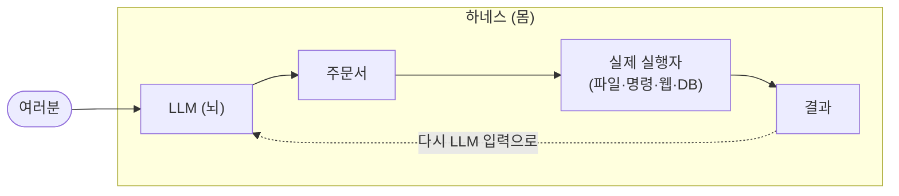

# 09. 에이전트: 손과 발이 생긴 AI

ChatGPT 한테 "내 데스크탑에 있는 문서.docx 를 열어서 첫 단락만 알려줘" 라고 부탁해보세요. 비슷한 답이 와요. "죄송하지만 저는 사용자의 파일에 접근할 수 없어요." 그런데 같은 부탁을 Claude Code 라는 도구한테 하면 — **진짜로 그 파일을 열어서 첫 단락을 보여줘요.** 같은 종류의 AI(LLM) 가 안에 들어 있는데, 어떻게 행동이 이렇게 다를까요?

답은 의외로 단순해요. **하나는 손발이 없고, 하나는 손발이 있어요.**

## 순수한 LLM 은 뇌만 있어요

지금까지 우리가 본 ChatGPT 는 — 정확히 말하면 **LLM 그 자체** 예요. 글을 받아서 글을 만드는 거대한 흉내쟁이. 1화부터 8화까지 다룬 모든 내용은 이 뇌의 동작 방식에 관한 거예요. 그런데 이 뇌는 — 정말로 정교한 두뇌이지만 — 완전히 무력해요.

```
[순수 LLM]

   여러분 → LLM → 글

   할 수 있는 것: 글 만들기
   할 수 없는 것: 파일 열기, 명령어 실행, 웹 검색, 어제 일 기억하기
```

뇌만 있고 몸이 없어요. 생각은 잘하지만, 실제로 세상에 손을 대는 건 못 해요.

## 에이전트 = 뇌 + 몸

**에이전트**(agent, 도구를 쓸 수 있도록 LLM 에 몸을 붙인 것) 는 이 뇌에 몸을 붙인 거예요. 이 몸을 **하네스**(harness, 원래 말의 마구. 여기선 LLM 을 감싸서 외부 세계와 연결해주는 실행 환경) 라고 불러요.



하네스가 하는 일은 다섯 가지쯤 있어요. 도구 호출의 통로 역할, 반복 루프 돌리기, 진행 상황 기억하기, 위험한 명령 막기, 사용자 승인 받기. 한꺼번에 들으면 복잡해 보이지만 — 핵심은 단순해요. **LLM 은 여전히 글만 만들어요.** 다만 그 글의 일부가 "주문서" 형태일 때, 하네스가 그걸 읽고 실제로 실행해주는 거예요.

## 주문서 한 장의 이야기

LLM 이 도구를 어떻게 쓰는지 한 시퀀스로 보면 이래요.

```
1. 사용자 → "데스크탑의 문서.docx 첫 단락 알려줘"

2. LLM → "주문서: 파일 읽기 (경로: ~/Desktop/문서.docx)"
   ↑ 이건 직접 실행이 아니라, 글로 쓴 주문이에요.

3. 하네스 → 주문을 읽고 실제로 파일 열어서 내용 가져옴
   결과: "안녕하세요. 이 문서는 ..."

4. 하네스 → 결과를 LLM 의 다음 입력으로 끼워 넣음

5. LLM → 결과를 보고 한 번 더 생각해서 사용자에게 답:
   "첫 단락은 이렇습니다: 안녕하세요. 이 문서는 ..."
```

여기서 가장 중요한 한 가지. **2번 단계에서 LLM 이 만든 건 결국 글이에요.** 파일을 직접 여는 코드가 LLM 안에 있는 게 아니라, 그냥 "이 형식으로 글을 쓰면 하네스가 알아서 실행해줄 거야" 라는 약속이 있는 거예요. 어쩐지 — 우리가 식당에서 종이 주문서를 작성하면 주방장이 그걸 보고 요리하는 흐름과 똑같아요. LLM 은 영원히 손님 자리에서 주문서만 써요. 직접 주방에 들어가는 건 하네스라는 종업원이에요.

## 깜짝 놀랄 만한 한 가지

가장 헷갈리기 쉬운 사실. **여러분이 ChatGPT, Claude Code, Gemini 같은 다른 AI 도구를 쓸 때, 그 안의 LLM 은 종종 비슷해요.** 다른 건 — 그 LLM 을 감싼 하네스예요. 같은 뇌가 들어 있어도, 어떤 몸을 입혀주느냐에 따라 완전히 다른 능력을 가진 존재처럼 보여요.

ChatGPT(웹 페이지 버전) 는 글을 주고받는 가벼운 몸을 입었어요. Claude Code 는 코드 작성에 특화된 몸을 입었고요(파일 시스템 접근, 명령 실행, 웹 검색 등). 같은 종류의 LLM 이 안에 들어 있어도, 행동이 완전히 다른 존재처럼 보이는 게 그 때문이에요. 그래서 같은 회사가 만든 모델이라도 어떤 도구로 쓰느냐에 따라 — 글쓰기 친구가 되기도 하고, 코딩 동료가 되기도 하고, 데이터 분석가가 되기도 해요.

## 손이 생기면 책임이 생겨요

뇌만 있던 시절의 LLM 은 사실 위험할 일이 별로 없었어요. 글이 어색하거나 틀리거나 — 그뿐이었어요. 그런데 손이 붙은 순간 — 진짜로 파일을 지울 수 있게 됐어요. 진짜로 메일을 보낼 수 있게 됐고요. 진짜로 결제를 할 수도 있게 됐어요.

그래서 좋은 하네스는 단순히 "도구 잘 호출해주는" 것에 그치지 않고 — "이 주문서는 위험하니 사용자에게 한 번 더 물어보자" 라는 안전 장치를 깔아둬요. Claude Code 가 파일을 지우려고 할 때 "정말 지울까요?" 라고 한 번 묻는 게 그 흔적이에요. 손이 생긴다는 건 책임이 함께 생긴다는 거예요. 그리고 그 책임을 어떻게 분담할 것인지 — 어디까지 자동화하고, 어디서 사람이 한 번 더 확인할 것인지 — 가 에이전트 설계의 가장 어려운 부분이에요.

## 비유에는 한계가 있어요

"비서·인턴" 비유로 시작했지만, 사실 이 비서는 사람보다 훨씬 빠르게 일해요. 우리가 한 번 부탁하면 — 1초 안에 수십 번의 주문서를 작성하고, 수십 개의 파일을 읽고, 결과를 종합해서 답을 내요. 그 속도 때문에 사람 비서로는 상상하기 어려운 일을 해내요. 다만 — 사람 비서와 달리 잘못된 판단이 일어났을 때 그걸 자기가 알아채진 못해요. 환각(6화) 이 손에 도구가 붙어 일어나면, 단순히 "잘못된 글" 이 아니라 "잘못된 행동" 이 돼요. 그래서 손이 큰 비서일수록, 외부의 눈으로 한 번씩 점검하는 장치가 필요해요. 사람이 직접 보거나, 점검 전용 AI 를 옆에 붙이는 식인데 — 어느 쪽이든 핵심은 "자기가 한 일을 자기가 검증하지 않는다" 예요.

> **더 깊이 들어가려면**: 실제 에이전트인 Claude Code 가 어떻게 설정되는지 — `CLAUDE.md` · Hooks · Skills 라는 세 축 — 는 [`claude-code-3-axes`](https://github.com/hojin12312/llm-field-notes/blob/main/appendix/tools/claude-code-3-axes.md) 부록에서, OpenAI 의 비슷한 에이전트인 Codex 의 설정 방식(`AGENTS.md` · 승인 모드 · MCP) 은 [`codex-usage`](https://github.com/hojin12312/llm-field-notes/blob/main/appendix/tools/codex-usage.md) 부록에서 자세히 다뤄요.

## 한 줄 요약

에이전트는 LLM 이라는 똑똑한 뇌에 도구를 쓸 수 있는 몸을 붙인 것이고, 그 몸의 정체는 LLM 의 글을 받아 실제 행동으로 옮겨주는 하네스라는 실행 환경이에요. 같은 LLM 이라도 어떤 몸을 입었느냐에 따라 완전히 다른 존재처럼 보여요.

## 다음 화

여기까지 우리는 AI 가 무엇을 할 수 있는지 봐왔어요. 마지막으로 — 무엇을 못 하는지를 정직하게 정리해야 해요. AI 가 자신만만한 톤으로 답한다고 해도, 그 답을 끝까지 책임지는 건 결국 사람의 몫이에요.

[10화 — AI 가 못하는 것들](10-limits.md)
