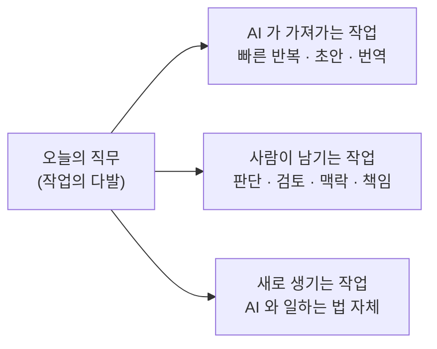

# 11. 내 자리는 안전한가요

AI 가 가장 먼저 가져갈 일자리는 뭘까요? 답을 들으면 좀 의아할 거예요.

운전기사도, 공장 노동자도 아니에요. **번역가·일러스트레이터·코드 작성자·콜센터 상담원** — 즉, 지식 노동이라 불려온 사무직 쪽이에요. 산업혁명이 가져간 직업이 주로 손과 발을 쓰는 일이었다면, 이번엔 머리를 쓰는 일 쪽에서부터 흔들리고 있어요. 그래서 이번 파동이 — 200년 전 **러다이트**(Luddite, 19세기 초 영국에서 기계가 일자리를 빼앗는다며 공장 기계를 파괴하고 다닌 직물 노동자 운동) 때와는 결이 좀 달라 보이는 거예요.

"이번엔 정말 다르다" 는 말이 떠도는 이유와, "그게 자동화가 등장할 때마다 늘 나오던 말이라는 사실" — 양쪽이 다 정직해요. 한 화 동안 양쪽을 다 보고, 결론은 잠시 미뤄둘게요.

## "이번엔 다르다" — 공포론의 합당한 근거

지난 100년의 자동화는 주로 — 무거운 걸 들고, 반복적으로 같은 동작을 하는 — 육체 작업을 대체해왔어요. 그래서 사무실에서 컴퓨터 앞에 앉아 있는 사람은 자동화의 안전지대처럼 보였죠. 글을 쓰고, 그림을 그리고, 코드를 짜고, 법률 문서를 해석하는 일은 "인간만이 할 수 있는 일" 의 대표 사례였어요.

LLM 이 그 안전지대 한가운데에서 등장했어요. 그리고 — 적당히 잘 해버려요. 번역은 어느새 사람 번역가의 평균 품질에 가까이 다가왔고, 일러스트는 흔한 작품 수준을 빠르게 따라잡고 있고, 콜센터의 1차 응대는 점점 AI 가 받아요. 코딩 보조 도구는 개발자 한 명의 산출량을 두세 배로 키우고 있고요.

공포론의 정직한 근거는 세 가지예요. **속도** — 이전 자동화 파동이 수십 년에 걸쳐 퍼졌다면, AI 는 몇 년 단위로 일터에 들어와 있어요. **폭** — 한 산업이 아니라 거의 모든 화이트칼라 직군이 동시에 영향을 받아요. **깊이** — 단순 반복 작업뿐 아니라, 글쓰기·기획·디자인 같은, 한때 "창의 노동" 으로 분류되던 부분에까지 닿아 있어요.

이 세 가지를 한꺼번에 보면 — 두려움을 느끼는 게 이상한 일은 아니에요.

## ATM 의 역설 — 회의론의 합당한 근거

그런데 자동화에는 유명한 역사적 사례가 하나 있어요. 1969년 미국에서 처음 ATM(현금자동인출기) 이 보급되기 시작했을 때, 사람들 예측은 명확했어요 — "곧 은행원은 다 사라진다."

```
미국 은행원 수의 대략적인 추이

1970   ████████████             약 30만 명
1985   ████████████████         약 40만 명
2010   ████████████████████     약 50만 명 이상
                                  ↑
                                  ATM 이 보급된 40년 동안
                                  은행원은 줄지 않고 늘었어요
```

ATM 이 보급된 후 수십 년, 은행원 수는 줄지 않고 — **오히려 늘었어요.**

원리는 이래요. ATM 이 한 지점의 직원 수를 줄인 건 맞아요. 그래서 지점 하나를 운영하는 비용이 싸졌어요. 그러자 은행들이 — 비용이 싸진 만큼 지점 수를 늘렸어요. 결국 지점 하나당 직원은 줄었는데 전체 직원 수는 늘어버린 거예요. 그리고 직원이 하는 일도 달라졌어요. 입출금 처리 같은 단순 업무 대신, 상담·영업·신용 평가 같은 — 사람의 판단이 필요한 — 일로 옮겨갔어요.

이게 자동화가 보통 흘러가는 패턴이에요. 어떤 작업이 자동화되면 (1) 그 작업의 단가가 떨어지고 (2) 단가가 떨어진 만큼 수요가 폭발하고 (3) 새 일자리가 다른 모양으로 만들어져요. 계산기가 회계사를 죽이지 않았고(오히려 한 명이 다룰 수 있는 장부가 늘었어요), 자동완성이 작가를 죽이지 않았고, 사진기가 화가를 죽이지 않았어요.

그리고 한 가지 더 — 10화에서 본 AI 의 한계들이 있죠. 시간을 모르고, 자기를 모르고, 책임지지 못한다는. 그 한계 때문에 — AI 가 만든 결과물 옆에는 항상 사람이 서 있어야 해요. 검토하고, 책임지고, 맥락에 맞춰 다듬는 사람이.

## 사라지는 게 아니라 — 달라지는 거예요

그래서 정직한 그림은 이런 거예요. 한 직무 (예: 번역가, 디자이너, 개발자) 는 사실 여러 작업이 묶인 다발이에요. AI 는 그 다발 중 일부를 가져갈 수 있어요. 하지만 다른 부분은 사람만 할 수 있는 채로 남고, 그 변화 자체가 새 작업을 만들어내요.



번역가는 "한 줄씩 옮기는 작업" 을 AI 에 넘기고, "결과물을 검수하고 문맥에 맞게 다듬는 작업" 의 비중을 키워요. 디자이너는 시안을 수십 장 만드는 일을 AI 에 넘기고, 그중 어느 방향이 정답인지를 고르는 일에 더 많은 시간을 써요. 개발자는 어디나 비슷한 모양의 정형화된 코드를 손으로 치는 대신, 시스템을 설계하고 검토하는 일에 시간을 더 써요.

그렇다고 모두에게 부드러운 전환이 보장된다는 뜻은 아니에요. 어떤 사람은 옮겨가지 못하고, 어떤 직군은 결국 크게 줄어들어요. 한 산업의 평균이 늘어난다고 해서, 그 안의 모든 개인이 무사한 건 아니거든요. "ATM 이 도입돼도 은행원 총수는 늘었다" 는 통계 뒤에는 — 1970년대 어느 지점에서 일자리를 잃은 한 사람의 이야기가 있어요. 평균은 평균이고, 개인은 개인이에요.

그래서 결론은 단정 짓지 않을게요. 다만 한 가지는 분명해요 — **AI 가 잘 못하는 일이 무엇인지 알고 있으면, 변화 속에서 내 자리는 훨씬 잘 보여요.** 10화의 한계 목록이 사실은 — 사람이 한동안 떠나지 않을 자리들의 목록이기도 해요.

## 한 줄 요약

AI 가 일자리를 다 빼앗는다는 말도, 자동화는 결국 다 잘 풀린다는 말도 — 둘 다 절반씩만 맞아요. 일자리는 사라지기보다 모양이 달라지고, 변화 속의 자리는 "AI 가 잘 못하는 일" 쪽에서 가장 또렷이 보여요.

## 다음 화

AI 가 내 일자리를 가져가느냐 마느냐의 논쟁과는 별개로, AI 를 매일 쓰는 우리 머릿속에는 — 조용히 — 다른 무언가가 쌓이고 있어요. 다음 화는 그 이야기예요.

[12화 — 빌려 쓴 똑똑함](12-technical-debt.md)
