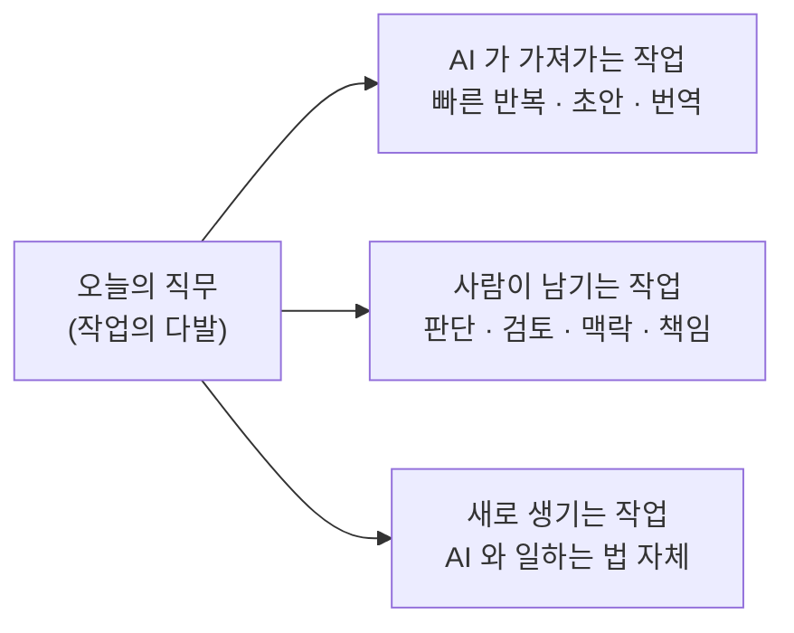

# 11. 내 자리는 안전한가요

AI 가 가장 먼저 가져갈 일자리는 뭘까요? 답을 들으면 좀 의아할 거예요.

운전기사도, 공장 노동자도 아니에요. **번역가·일러스트레이터·코드 작성자·콜센터 상담원** — 즉, 지식 노동이라 불려온 사무직 쪽이에요. 산업혁명이 가져간 직업이 주로 손과 발을 쓰는 일이었다면, 이번엔 머리를 쓰는 일 쪽에서부터 흔들리고 있어요. 그래서 이번 파동이 — 200년 전 **러다이트**(Luddite, 19세기 초 영국에서 기계가 일자리를 빼앗는다며 공장 기계를 파괴하고 다닌 직물 노동자 운동) 때와는 결이 좀 달라 보이는 거예요.

"이번엔 정말 다르다" 는 말이 떠도는 이유, 그리고 그 말 자체가 가진 위험. 둘 다 정직하게 들여다보고, 그 다음 자동화가 실제로 어떻게 흘러왔는지를 보면 — 균형 잡힌 그림이 보여요.

## 일자리 종말론이 타당한 이유

먼저 종말론의 합당한 근거부터요. "AI 가 일자리를 다 가져간다" 는 말은 단순한 호들갑이 아니에요. 지난 자동화 파동과 이번 파동 사이에는 분명한 차이가 셋 있어요.

**속도가 달라요.** 지난 자동화는 수십 년에 걸쳐 퍼졌어요. ATM 은 20년에 걸쳐 보급됐고, 컴퓨터가 사무실에 자리 잡는 데도 10년이 넘게 걸렸어요. AI 는 다른 시간 단위에서 움직여요. ChatGPT 가 나온 게 2022년 말이었는데, 3년 만에 거의 모든 산업이 어떤 식으로든 AI 를 쓰고 있어요. 변화에 적응할 시간이 — 지난 파동의 10분의 1쯤으로 짧아졌어요.

**폭이 달라요.** 지난 자동화는 한 산업에 한 번씩 닿았어요. 직물 산업, 자동차 공장, 전화 교환원, 콜센터 — 한 분야에 들어가서 그 분야의 변화를 만들었죠. AI 는 거의 모든 화이트칼라 직군에 동시에 영향을 줘요. 글을 쓰는 일, 그림을 그리는 일, 코드를 짜는 일, 법률 문서를 다루는 일, 사람을 상담하는 일까지. 한 사람이 다른 산업으로 옮겨가서 피하기가 — 그만큼 어려워졌어요.

**깊이가 달라요.** 지난 자동화는 단순 반복 작업만 가져갔어요. 그래서 "사람만이 할 수 있는" 영역이 늘 남아 있었죠. 글쓰기, 기획, 디자인, 판단 같은. AI 는 그 영역에까지 닿아 있어요. 적당히 잘 해버려요. 번역은 이미 사람 번역가의 평균 품질에 가까워졌고, 일러스트는 흔한 작품 수준을 빠르게 따라잡고 있어요. 코딩 보조 도구는 개발자 한 명의 산출량을 두세 배로 키우고 있고요.

세 가지를 한꺼번에 보면 — 두려움이 비합리적인 게 아니라는 걸 알 수 있어요. "이번엔 정말 다르다" 는 말의 절반은 진짜로 맞아요.

## 그런데 — 종말론 자체에도 함정이 있어요

다만 두려움이 합당한 근거를 가졌다고 해서, 두려움이 시키는 행동까지 합당한 건 아니에요. 종말론은 그 자체로 부작용을 만들어요.

가장 또렷한 사례가 곧 다룰 방사선과 이야기예요. 2016년에 한 권위 있는 학자가 "방사선과 의사는 5년이면 사라진다" 고 단언했어요. 그 한마디가 의대생들의 진로 선택을 흔들었고, 10년이 지난 지금 — 미국은 오히려 방사선과 의사가 모자라 진료 대기가 길어지고 있어요. 종말론이 채우지 못한 빈자리를 만들어버린 거예요. **자기 충족적 예언**(self-fulfilling prophecy, 어떤 예측을 듣고 사람들이 그에 맞춰 행동한 결과 그 예측이 실제로 일어나는 현상) 이 거꾸로 작동한 셈이에요. 예측이 빗나갔는데, 빗나간 자리에 다른 형태의 손실이 생겼어요.

종말론은 또 — **도구를 외면하게 만들어요.** "어차피 AI 가 다 가져갈 거니까" 라는 체념은, AI 를 적극적으로 익혀서 활용하는 길을 막아요. 진짜 변화는 — 두 직군 사이에서가 아니라, 같은 직군 안에서 일어나요. AI 를 잘 쓰는 사람이 그렇지 않은 사람의 자리를 흡수해요. 두려움이 그 적응을 가로막으면, 종말론을 가장 진지하게 들은 사람이 가장 먼저 자리를 잃어요.

세 번째로 — 종말론은 **개인을 무력하게 만들어요.** "내가 뭘 해도 어차피 안 되는 흐름" 이라고 느끼면 학습할 의지도, 새 자리를 찾을 의지도 약해져요. 사회 전체가 그 무력감에 빠지면 변화의 비용을 누구도 짊어지지 않으려 하고, 결국 가장 약한 자리의 사람들이 모든 짐을 지게 돼요.

두려움 자체는 이상한 게 아니에요. 다만 두려움이 행동을 잠가버리면 — 그 두려움이 예측의 일부를 사실로 만들어버려요.

## 방사선과 의사 — 사라진다더니

그러면 자동화는 실제로 어떻게 흘러왔을까요. 가장 가까운 사례가 — 방금 언급한 방사선과예요.

2016년에 AI 분야의 대부 격인 제프리 힌튼이 한 자리에서 단호하게 말했어요. **"지금 당장 방사선과 의사 양성을 멈춰야 합니다."** 5년이면 AI 가 영상 판독을 사람보다 잘하게 되고, 방사선과 의사라는 직업은 사라진다는 거였어요.

그리고 10년이 지났어요. 지금의 현실은 — 정반대예요.

```
2016   ████████████████          힌튼: "5년이면 사라진다"

2026   ██████████████████        의사 수 약 +10%  ·  평균 연봉 $571K  ·  인력 부족
                                    ↑
                                    예측의 정확히 반대편
```

미국 방사선과 의사 수는 지난 10년 사이 약 10퍼센트 늘었고, 평균 연봉은 약 57만 달러까지 올라가 있고요. 메이요 클리닉 한 곳만 봐도 방사선과 인력이 55퍼센트나 늘었어요. 그리고 — 사람이 모자라요.

엔비디아 CEO 젠슨 황은 이 일을 종종 인용해요. 그의 정리는 이래요 — **"방사선과 의사의 일은 영상을 들여다보는 게 아니에요. 질병을 진단하는 거예요. 그리고 오늘날 거의 모든 방사선과 의사가 어떤 식으로든 AI 를 쓰고 있어요."** AI 가 영상 판독이라는 한 작업을 빠르게 해주니, 의사 한 명이 처리할 수 있는 검사 건수가 늘었고, 그만큼 영상 검사 자체의 수요가 폭발했어요. AI 가 일을 가져갔다기보단 — 일을 더 만들어버린 거예요. 그리고 일의 모양은 영상 들여다보기에서 진단·판단 쪽으로 옮겨갔어요.

50년 전 ATM 이 처음 보급되었을 때도 비슷한 일이 있었어요. "곧 은행원은 다 사라진다" 던 예측과 달리 미국 은행원 수는 1970년 약 30만 명에서 50만 명대로 늘었어요. 지점당 직원은 줄었지만, 비용이 싸진 만큼 지점 수가 늘었고 직원의 일도 단순 입출금에서 상담·영업 쪽으로 옮겨갔거든요.

이게 자동화가 보통 흘러가는 패턴이에요. 어떤 작업이 자동화되면 (1) 그 작업의 단가가 떨어지고 (2) 단가가 떨어진 만큼 수요가 폭발하고 (3) 일의 모양이 — 사람의 판단이 필요한 쪽으로 — 달라져요. 계산기가 회계사를 죽이지 않았고, 자동완성이 작가를 죽이지 않았고, 사진기가 화가를 죽이지 않았어요.

그리고 한 가지 더 — 10화에서 본 AI 의 한계들이 있죠. 시간을 모르고, 자기를 모르고, 책임지지 못한다는. 그 한계 때문에 — AI 가 만든 결과물 옆에는 항상 사람이 서 있어야 해요. 검토하고, 책임지고, 맥락에 맞춰 다듬는 사람이.

## 사라지는 게 아니라 — 달라지는 거예요

그래서 정직한 그림은 이런 거예요. 한 직무 (예: 번역가, 디자이너, 개발자) 는 사실 여러 작업이 묶인 다발이에요. AI 는 그 다발 중 일부를 가져갈 수 있어요. 하지만 다른 부분은 사람만 할 수 있는 채로 남고, 그 변화 자체가 새 작업을 만들어내요.



번역가는 "한 줄씩 옮기는 작업" 을 AI 에 넘기고, "결과물을 검수하고 문맥에 맞게 다듬는 작업" 의 비중을 키워요. 디자이너는 시안을 수십 장 만드는 일을 AI 에 넘기고, 그중 어느 방향이 정답인지를 고르는 일에 더 많은 시간을 써요. 개발자는 어디나 비슷한 모양의 정형화된 코드를 손으로 치는 대신, 시스템을 설계하고 검토하는 일에 시간을 더 써요. 방사선과 의사는 영상에서 이상을 찾는 데 쓰던 시간을 — 환자에게 진단을 설명하고 다음 단계를 결정하는 데 더 쓰고 있어요.

그렇다고 모두에게 부드러운 전환이 보장된다는 뜻은 아니에요. 어떤 사람은 옮겨가지 못하고, 어떤 직군은 결국 크게 줄어들어요. 평균이 늘어난다고 해서 그 안의 모든 개인이 무사한 건 아니거든요. 방사선과 의사의 총수가 늘었다는 통계 뒤에는, 그 변화의 속도를 따라잡지 못한 한 사람의 이야기도 있어요. 평균은 평균이고, 개인은 개인이에요.

그래서 결론은 단정 짓지 않을게요. 다만 두 가지는 분명해요. 첫째, **두려움에 마비되어 가만히 있으면 자리는 더 빨리 사라져요** — 종말론이 자기 충족적 예언이 되는 자리는 늘 그쪽에 있어요. 둘째, **AI 가 잘 못하는 일이 무엇인지 알고 있으면 변화 속 내 자리는 훨씬 잘 보여요.** 10화의 한계 목록이 사실은 — 사람이 한동안 떠나지 않을 자리들의 목록이기도 해요.

## 한 줄 요약

일자리 종말론은 합당한 근거를 가지고 있는 동시에, 두려움 자체가 자기 충족적 예언을 만들어내는 위험도 함께 가지고 있어요. 일자리는 사라지기보다 모양이 달라지고, 변화 속의 자리는 "AI 가 잘 못하는 일" 쪽에서 가장 또렷이 보여요.

## 다음 화

AI 가 내 일자리를 가져가느냐 마느냐의 논쟁과는 별개로, AI 를 매일 쓰는 우리 머릿속에는 — 조용히 — 다른 무언가가 쌓이고 있어요. 다음 화는 그 이야기예요.

[12화 — 빌려 쓴 똑똑함](12-technical-debt.md)
