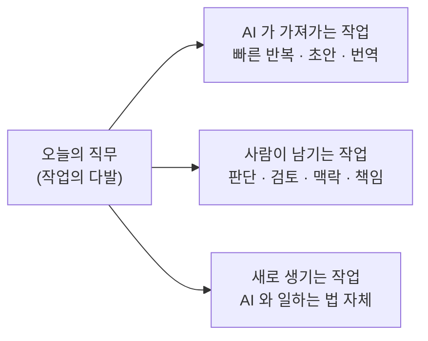

# 11. 내 자리는 안전한가요

AI 가 가장 먼저 가져갈 일자리는 뭘까요? 답이 좀 의외예요.

운전기사도, 공장 노동자도 아니에요. **번역가·일러스트레이터·코드 작성자·콜센터 상담원** — 산업혁명이 안전지대처럼 두고 갔던 사무직 쪽이에요. 그래서 이번 파동이 200년 전 **러다이트**(Luddite, 19세기 영국에서 기계가 일자리를 빼앗는다며 공장 기계를 부수러 다닌 직물 노동자 운동) 때와는 결이 좀 달라요.

종말론에는 합당한 근거가 있어요. 동시에 — 종말론 자체에도 함정이 있고요. 둘 다 보고 나면, 자동화가 실제로 어떻게 흘러왔는지가 의외로 또렷이 보여요.

## "이번엔 정말 다르다" — 그 말의 절반은 맞아요

지난 100년의 자동화는 손과 발을 쓰는 일을 가져갔어요. 글 쓰고 그림 그리고 코드 짜고 사람을 상담하는 일은 — "사람만 할 수 있는 일" 이었죠. LLM 은 그 안전지대 한가운데에서 등장했고, 적당히 잘 해버려요.

종말론의 합당한 근거는 세 가지예요. **속도** — 지난 자동화가 수십 년에 걸쳐 퍼졌다면, AI 는 몇 년 단위로 일터에 들어와요. **폭** — 한 산업이 아니라 거의 모든 화이트칼라 직군에 동시에. **깊이** — 단순 반복이 아니라 기획·디자인·판단 같은 "창의 노동" 의 영역까지. 세 가지를 한꺼번에 보면 — 두려움이 비합리적인 게 아니라는 걸 알 수 있어요.

## 그런데 — 종말론 자체에도 함정이 있어요

두려움이 합당한 근거를 가졌다고 해서, 두려움이 시키는 행동까지 합당한 건 아니에요. 종말론은 도구를 외면하게 만들고("어차피 AI 가 다 가져갈 텐데"), 사람을 무력하게 만들고, 자기 자신을 부분적으로 실현시키기도 해요. (예고편 — 다음 섹션 방사선과 사례에서 정확히 그 일이 일어났어요.)

가장 깊은 함정은 따로 있어요. **잘못된 산수**예요. "AI 가 일을 가져간다" 는 말은 알게 모르게 "세상에 일거리의 총량은 정해져 있다" 는 가정 위에 서 있거든요. 한 사람이 두 배로 빨라지면 누군가 한 명은 잘려야 한다는 결론은, 이 (잘못된) 가정 위에서만 성립해요. 경제학은 이걸 **노동 총량의 오류**(Lump of Labor Fallacy, 일거리 총량이 고정되어 있다고 가정하는 인지 오류) 라고 불러요.

코드가 가장 또렷한 사례예요. 아직 소프트웨어가 닿지 않은 분야가 어마어마하고(소상공인 행정·농업 데이터·지역 행정·1인 사업자 자동화·의료 기록 정리), 이미 닿은 분야조차 자율주행·로봇·생명과학·우주처럼 훨씬 더 복잡한 코드가 얹어질 여지가 끝없어요. 단가가 떨어지면 수요가 폭발해요. 19세기 영국에서 석탄 효율이 좋아질수록 석탄 소비가 폭발했던 — **제번스의 역설** — 과 정확히 같은 모양이에요. 종말론은 이 폭발을 보지 않은 채, 분자만 가지고 분수를 계산해요.

## 방사선과 의사 — 사라진다더니

가장 가까운 실제 사례가 방사선과예요. 2016년 AI 분야의 대부 격인 제프리 힌튼이 한 자리에서 단호하게 말했어요. **"지금 당장 방사선과 의사 양성을 멈춰야 합니다."** 5년이면 AI 가 영상 판독을 더 잘할 거고, 방사선과 의사는 사라진다는 거였어요. 권위 있는 학자의 단언이었으니 의대생들 사이에 큰 동요가 있었죠.

그리고 10년이 지났어요. 지금의 현실은 — 정반대예요.

```
2016   ████████████████          힌튼: "5년이면 사라진다"

2026   ██████████████████        의사 수 +10%  ·  평균 연봉 $571K  ·  인력 부족
                                    ↑
                                    예측의 정확히 반대편
```

미국 방사선과 의사 수는 약 10퍼센트 늘었고, 평균 연봉은 약 57만 달러까지 올라가 있어요. 사람이 모자라 진료 대기가 길어지고 있고요. 종말론을 너무 진지하게 들은 의대생들이 다른 전공을 택했고, 종말론이 채우지 못한 빈자리를 만들어버린 거예요.

엔비디아 CEO 젠슨 황의 한 줄 정리가 날카로워요 — **"방사선과 의사의 일은 영상을 들여다보는 게 아니라 질병을 진단하는 거예요. 그리고 오늘날 거의 모든 방사선과 의사가 어떤 식으로든 AI 를 쓰고 있어요."** AI 가 한 작업을 도와주니 의사 한 명이 처리할 수 있는 검사 건수가 늘었고, 영상 검사 자체의 수요가 폭발했어요. 일이 사라진 게 아니라 — 일이 더 만들어진 거예요.

50년 전 ATM 도 같은 결이었어요. "은행원은 곧 사라진다" 던 예측과 달리 은행원 수는 늘었고, 직원의 일은 입출금에서 상담·영업 쪽으로 옮겨갔어요. 계산기가 회계사를 죽이지 않았고, 사진기가 화가를 죽이지 않은 것과 같은 이야기예요. 10화에서 본 AI 의 한계 (시간을 모르고, 자기를 모르고, 책임지지 못함) 때문에 — AI 가 만든 결과물 옆에는 항상 사람이 서 있어야 한다는 점도 빼놓을 수 없고요.

## 사라지는 게 아니라 — 달라지는 거예요

정직한 그림은 이래요. 한 직무는 사실 여러 작업이 묶인 다발이에요. AI 는 그 다발 중 일부를 가져갈 수 있어요. 다른 부분은 사람만 할 수 있는 채로 남고, 변화 자체가 새 작업을 만들어내요.



번역가는 한 줄씩 옮기는 작업 대신 검수·다듬기의 비중을 키우고, 디자이너는 시안 양산 대신 방향 고르기에 시간을 더 써요. 개발자는 정형화된 코드 대신 시스템 설계와 검토에. 방사선과 의사는 영상 판독에서 진단·설명 쪽으로.

물론 모두에게 부드러운 전환이 보장된 건 아니에요. 어떤 사람은 옮겨가지 못해요. 평균이 늘어난다고 그 안의 모든 개인이 무사한 건 아니거든요. **평균은 평균이고, 개인은 개인이에요.**

그래서 결론은 단정 짓지 않을게요. 다만 두 가지는 분명해요. 첫째, **두려움에 마비되어 가만히 있으면 자리는 더 빨리 사라져요.** 둘째, **AI 가 잘 못하는 일이 무엇인지 알면 변화 속 내 자리가 훨씬 잘 보여요.** 10화의 한계 목록이 사실은 — 사람이 한동안 떠나지 않을 자리들의 목록이기도 해요.

## 한 줄 요약

일자리 종말론은 합당한 근거를 가진 동시에, 두려움 자체가 새로운 손실을 만들어내는 위험도 함께 가지고 있어요. 일자리는 사라지기보다 모양이 달라지고, 변화 속 자리는 "AI 가 잘 못하는 일" 쪽에서 가장 또렷이 보여요.

## 더 깊이 들어가려면

이 화에서 짧게 짚은 — 노동 총량의 오류·제번스의 역설·힌튼/황의 정확한 발언·방사선과 데이터·ATM 의 메커니즘·학자들의 갈라진 견해 — 는 자매편 부록에 디테일하게 풀어두었어요.

- [`llm-field-notes/appendix/tools/ai-and-jobs.md`](https://github.com/hojin12312/llm-field-notes/blob/main/appendix/tools/ai-and-jobs.md) — AI 와 일자리: 합리적 공포와 합리적 회의

## 다음 화

AI 가 내 일자리를 가져가느냐 마느냐와 별개로, AI 를 매일 쓰는 우리 머릿속에는 — 조용히 — 다른 무언가가 쌓이고 있어요. 다음 화는 그 이야기예요.

[12화 — 빌려 쓴 똑똑함](12-technical-debt.md)
