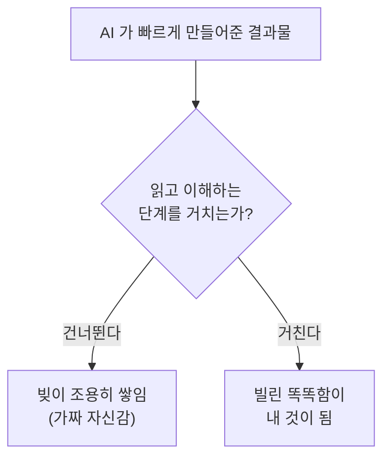

# 11. 빌려 쓴 똑똑함

AI 한테 보고서를 맡겼어요. 5분 만에 깔끔한 10페이지가 나왔어요. 그런데 다음 날 회의에서 누가 "3페이지의 이 숫자, 근거가 뭐죠?" 라고 물었을 때 — 여러분은 답할 수 있나요?

답할 수 없다면, 여러분은 방금 빚을 하나 진 거예요. 그것도 이자가 붙는 빚을.

## 빚이라는 오래된 비유

소프트웨어를 만드는 사람들 사이에 **기술 부채**(technical debt, 빨리 끝내려고 미뤄둔 일이 나중에 이자처럼 불어나는 비용) 라는 말이 있어요. 1992년에 워드 커닝햄이라는 개발자가 만든 표현이에요. 돈을 빌리면 당장은 편하지만 갚을 때까지 이자가 붙죠. 일도 똑같아요. "일단 대충 돌아가게만 만들고 정리는 나중에" 하고 미뤄둔 부분은, 시간이 지날수록 그 위에 뭔가를 더 얹기 어려워지면서 비용이 이자처럼 불어나요.

여기서 중요한 건 — **빚 자체가 나쁜 게 아니라는 점**이에요. 갚을 계획이 있으면 빚은 훌륭한 전략이에요. 급할 때 빌려서 빨리 해내고, 여유가 생기면 갚으면 되니까요. 진짜 위험은 빚이 있다는 사실 자체를 잊어버릴 때예요. 그러면 어느 순간 이자만 갚느라 새 일을 못 하는 상태가 돼요.

AI 시대에 이 오래된 비유가 갑자기 다시 뜨거워졌어요. AI 가 결과물을 너무 빨리, 너무 쉽게 만들어주거든요. 빨리 만든 만큼 빨리 쌓이는 빚이 있어요. 그런데 이 빚은 좀 특이한 데가 있어요. **빚이 결과물이 아니라, 사람 머릿속에 쌓여요.**

## 이해 부채 — 내 이름인데 내가 모르는 것

개발자 애디 오스마니가 만든 말 중에 **이해 부채**(comprehension debt, 만들어진 결과물의 양과 사람이 실제로 이해한 양 사이의 격차) 라는 게 있어요. 풀어 쓰면 이래요 — 세상에 나온 내 결과물은 10페이지인데, 내가 진짜로 이해하고 있는 건 3페이지어치뿐인 상태.

보통의 빚은 자기 존재를 티 내요. "이 부분 고치기 진짜 불편하네" 하는 마찰로 우리에게 신호를 보내죠. 그런데 이해 부채는 그런 신호가 없어요. 결과물이 일단 그럴듯하게 굴러가니까요. 오히려 **가짜 자신감**(false confidence) 을 키워요. "어, 다 됐네?" 싶은데 사실 그 안을 한 번도 들여다본 적이 없는 거예요.

```
████████████████████████  AI 가 만들어준 양 (쭉쭉 늘어남)
██████                    내가 이해한 양 (더디게 늘어남)
      ↑
      이 벌어진 틈이 '이해 부채'
```

오스마니가 콕 집은 말이 날카로워요. "결과물을 싸게 만들 수 있게 됐다고 해서, 이해를 싸게 건너뛸 수 있게 된 건 아니다." 10화 끝에서 "AI 의 모든 답에는 사람의 검토가 따라야 한다" 고 했었죠. 문제는 — AI 가 만들어내는 속도가 사람이 검토하는 속도를 너무 쉽게 앞질러버린다는 거예요. 품질을 거르는 관문이던 검토가, 어느새 일을 막는 병목이 돼버려요.

## 인지 부채 — 안 쓰면 약해지는 근육

빚의 두 번째 종류는 더 무서워요. **인지 부채**(cognitive debt, AI 에 계속 의존하면서 사람 본인의 능력이 약해지는 현상).

깜짝 놀랄 만한 연구가 하나 있어요. AI 보조를 적극적으로 쓴 사람들에게 자기가 방금 다룬 내용을 제대로 이해했는지 퀴즈를 냈더니 — AI 를 덜 쓴 사람들보다 약 17퍼센트 낮은 점수를 받았어요. 특히 "문제가 생겼을 때 원인을 찾아 고치는 능력" 에서 가장 크게 떨어졌고요.

이상한 일이 아니에요. 근육과 똑같은 원리예요. 무거운 걸 AI 가 다 들어주면, 당장은 편하지만 내 팔 근육은 그만큼 안 자라요. 계산기를 늘 쓰면 암산이 둔해지는 것과 같아요. 차이가 있다면 — 계산기는 암산 하나를 가져갔지만, AI 는 "스스로 생각해서 풀어내는 과정" 전체를 가져갈 수 있다는 점이에요.

## 그래서 AI 를 쓰지 말라는 건가요

아니에요. 정반대예요.

이 빚 이야기의 결론은 "AI 를 쓰지 말자" 가 절대 아니에요. 빚이 좋은 전략일 수 있는 것처럼, AI 도 훌륭한 전략이에요. 결론은 딱 하나 — **빚이 쌓이고 있다는 걸 잊지 말 것.** 그리고 갚을 계획을 같이 둘 것.

갚는 방법은 의외로 단순해요. AI 가 만들어준 걸 "슬쩍 보고 넘기는" 대신, 한 번은 제대로 읽는 거예요. 모르는 부분이 있으면 AI 에게 "이건 왜 이렇게 했어?" 하고 되묻고, 그 답을 내 머리로 한 번 더 소화하는 거예요. 그 한 단계가 — 이해 부채를 갚는 가장 직접적인 방법이에요.



빌린 똑똑함은 그 자체로 나쁜 게 아니에요. 다만 빌린 채로 두면 영영 내 것이 안 되고, 한 번 소화하면 그때 비로소 내 것이 돼요. 그 차이가 — 빚을 지고 사는 사람과, 빚을 굴려 자산을 키우는 사람의 차이예요.

## 한 줄 요약

AI 는 결과물을 빠르게 빌려주지만, 그 속도만큼 "내가 이해하지 못한 부분" 이라는 빚이 조용히 쌓여요. 빚을 지지 말라는 게 아니라 — 빚인 줄 알고, 한 번은 제대로 읽어서 갚으라는 거예요.

## 다음 화

여기까지가 본편이에요. 우리는 AI 가 무엇인지, 무엇을 못 하는지, 그리고 우리에게 무엇을 남기는지까지 함께 걸어왔어요. 이제 정말 마지막 한 화 — 제목에 숨어 있던 "latent space" 의 정체를 풀고, 우리가 걸어온 길을 천천히 돌아볼게요.

[나오며 — latent space 라는 산책](99-epilogue.md)
